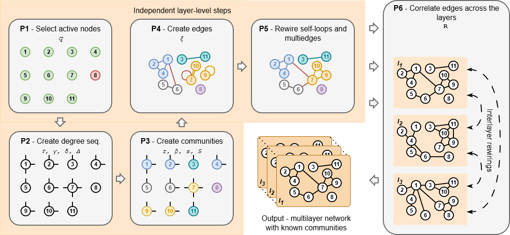
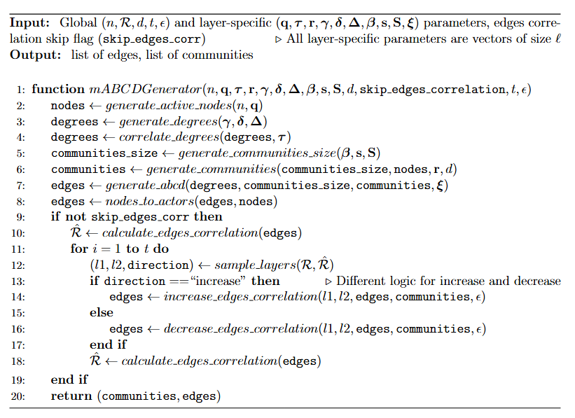

# MLNABCDGraphGenerator.jl
[](https://krainskil.github.io/MLNABCDGraphGenerator.jl/dev/)
[](https://codecov.io/github/KrainskiL/MLNABCDGraphGenerator.jl)
## Installation
Run the following commands in your Julia REPL:
```julia
using Pkg
Pkg.add(url="https://github.com/bkamins/ABCDGraphGenerator.jl")
Pkg.add(url="https://github.com/KrainskiL/MLNABCDGraphGenerator.jl")
```

## High level design
The model is splitted into six phases which executed together form full mABCD model. The steps may also be turned off or executed in separation allowing for greater flexibility and promoting reuse of components in new algorithms. Picture below illustrates each phase and lists related parameters:



For more routine-oriented flow, see pseudocode below:


## Usage
The main file intended to be used is `mlnabcd_sampler.jl`.
The script requires a configuration file with global parameters (see `utils/example_config.toml`).
Contents of the file:
```
seed = "42"                                         # RNG seed, use "" for no seeding
n = "1000"                                          # number of agents
edges_cor = "example_edges_cor_matrix.csv"          # desired edges correlation
                                                    # if set to empty string edge correlation step is omitted,
                                                    # if set to value in <0.0;1.0> all pairwise correlations between layers will be adjusted to given value
                                                    # if set to filename with .csv extension, correlation matrix will be loaded from specified file
layer_params = "example_layer_params.csv"           # file with parameters for each layer
d_max_iter = "1000"                                 # maximum number of iterations for sampling degrees
c_max_iter = "1000"                                 # maximum number of iterations for sampling cluster sizes
t = "100"                                           # number of batches for edge rewiring
e = "0.01"                                          # percent of edges to be rewired in each rewiring batch
d = "2"                                             # dimensionality of latent space
edges_filename = "example_edges.dat"                # name of file for output edges
communities_filename = "example_communities.dat"    # name of file for output communities
```
Layer-specific parameters are provided in file referenced under `layer_params` key.
Example layers specification formatted as Markdown table (see also `utils/example_layer_params.csv`):

| q    | tau  | r    | gamma | delta | Delta | beta | s | S  | xi  |
|------|------|------|-------|-------|-------|------|---|----|-----|
| 1    | 1    | 1    | 2,5   | 2     | 25    | 1,5  | 8 | 32 | 0,2 |
| 0,75 | 0,75 | 0,75 | 2,5   | 2     | 25    | 1,5  | 8 | 32 | 0,2 |
| 0,5  | 0,5  | 0,5  | 2,5   | 2     | 20    | 1,7  | 8 | 32 | 0,2 |
| 0,25 | 0,25 | 0,25 | 2,5   | 2     | 20    | 1,7  | 8 | 32 | 0,1 |

Edges correlation matrix is provided in file referenced under `edges_cor` key.
If `edges_cor = ""` edges correlation step is skipped.
If `edges_cor` is a value between 0.0 and 1.0, e.g. `edges_cor = "0.5"`, all pairwise correlations between layers will be adjusted to the given value.
Example correlation matrix formatted as Markdown table (see also `utils/example_edges_cor_matrix.csv`):

|   | 1    | 2    | 3    | 4    |
|---|------|------|------|------|
| 1 | 1.0  | 0.15 | 0.15 | 0.12 |
| 2 | 0.15 | 1.0  | 0.2  | 0.1  |
| 3 | 0.15 | 0.2  | 1.0  | 0.2  |
| 4 | 0.12 | 0.1  | 0.2  | 1.0  |

The three files contain all parameters required to generate MLNABCD graph.

Here is an output from an example session using CLI:
```
$ cd utils
$ julia mlnabcd_sampler.jl example_config.toml
[ Info: Usage: julia mlnabcd_sampler.jl config_filename
[ Info: For the syntax of config_filename see example_config.toml file
```
After the program terminates two files `example_communities.dat` and `example_edges.dat` are created in the working directory.

Structure of the `example_communities.dat` is as follows:
```
community_number layer_number
```
Each layer contains assignments for all `n` agents. Inactive agents are assigned to community 0.

Structure of the `example_edges.dat` is as follows:
```
agent1_label agent2_label layer_number
```
Edges are based on labels of active agents.

## Defaults and minimal configuration

As the framework provides multiple parameters it may be daunting at first to experiment with confidence. To accommodate a swift start, we provide a minimal set of parameters in `utils/default_config.toml` and `utils/default_layer_params.csv`.

Default config sets only required parameters:
```
seed = "42"
n = "1000"
edges_cor = ""
layer_params = "default_layer_params.csv"
```
With `edges_cor = ""` edges correlation is not controlled by the model, which simplifies computations and is suitable for users accepting any correlation produced by underlying ABCD generator.
Omitted parameters are set to the defaults as follows:

| Parameter | Default |
|-----------|---------|
| `d_max_iter` | 1000 |
| `c_max_iter` | 1000 |
| `t` | 100 |
| `e` | 0.01 |
| `d` | 2 |
| `edges_filename` | edges.dat |
| `communities_filename` | communities.dat |

Layers configuration defines only two layers with identical specification. In particular, all agents are active (`q=1`), no degrees-related (`tau=0`) and communities-related (`r=0`) correlations occur and half of edges will be created within communities (`xi=0.5`).

| q    | tau  | r    | gamma | delta | Delta | beta | s | S  | xi  |
|------|------|------|-------|-------|-------|------|---|----|-----|
| 1    | 0   | 0    | 2,5   | 2     | 25    | 1,5  | 8 | 32 | 0,5 |
| 1 | 0 | 0 | 2,5   | 2     | 25    | 1,5  | 8 | 32 | 0,5 |

You can run command below to produce `edges.dat` and `communities.dat` files:
```
$ cd utils
$ julia mlnabcd_sampler.jl default_config.toml
```